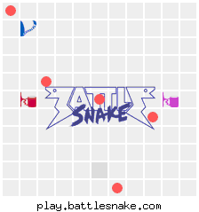

This is an undergrad course project at the University of Victoria. I (Yang Li) contributed most of the work to it. Other members: Ahmed Siddiqui, Louis Kraak, Michail Roesli, Swapnil Daxini.

## Contents
For detailed descriptions, please check the report.pdf (https://github.com/Fool-Yang/AlphaSnake-Zero/blob/master/report.pdf).

Presentation:

<figure class="video_container">
  <iframe src="https://drive.google.com/file/d/12Hr78S1oMO34BEdedrI0sOAhaIAdE3jO/preview" frameborder="0" allowfullscreen="true"> </iframe>
</figure>

## Abstract
A lot of studies have been done on reinforcement learning recently. Q learning, or DQN tries to solve the single agent vs environment problem, where some other approaches such as AlphaGo attempt the double agent game. In this project, we try to find an algorithm to generate an agent that performs well in a multiagent synchronous strategy game. Although this project is specific to the game called Battlesnake, the method and algorithms we used is not limited to it. The math holds for any synchronous game that has a finite state and action space.

## Requirments:
Python 3.7.6

NumPy 1.18.1

TensorFlow 2.1.0

Keras 2.3.1

## Instructions:
Run train.py to start training models. If you enter an existing model name and a generation number > 0, it will try to start using the existing model (e.g. if you enter the model family name "MySnake", and generation number "7", it will try to open the file "MySnake7.h5" in the "models" folder and start training). Otherwise it will create a new model and start training. All models will be stored in the "models" folder as .h5 files.

Run test_models.py to watch some games played by the model.

Run test_pit.py to run a large number of games between 2 models and observe the stats.

Run test_weights.py to see details of the artificial neural network.
